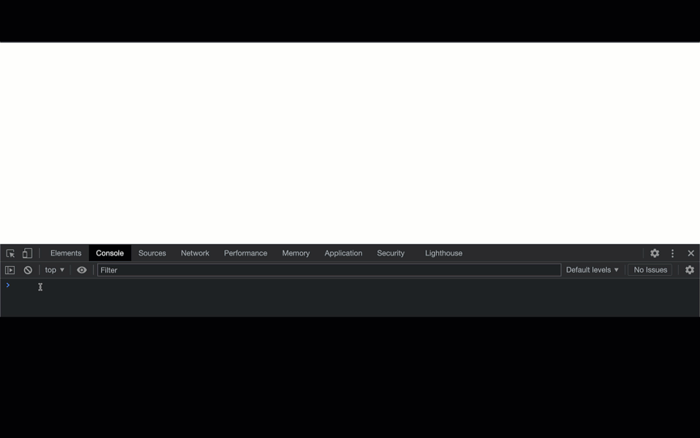

<!-- ## [blogs:](blogs.md) [being digital](blogbeingdigital.md) [skeuomorph](blogskeuomorph.md) [programming](blogprogramming.md)
## tutorial: [discord slash commands-ping](https://github.com/audiobeing/thehelloworldproject/blob/main/discord-ping.md) [tidal](tutorials/tidalCycles/1_tidal_intro.md) -->

 
 
<!-- 

 -->

<!--  -->