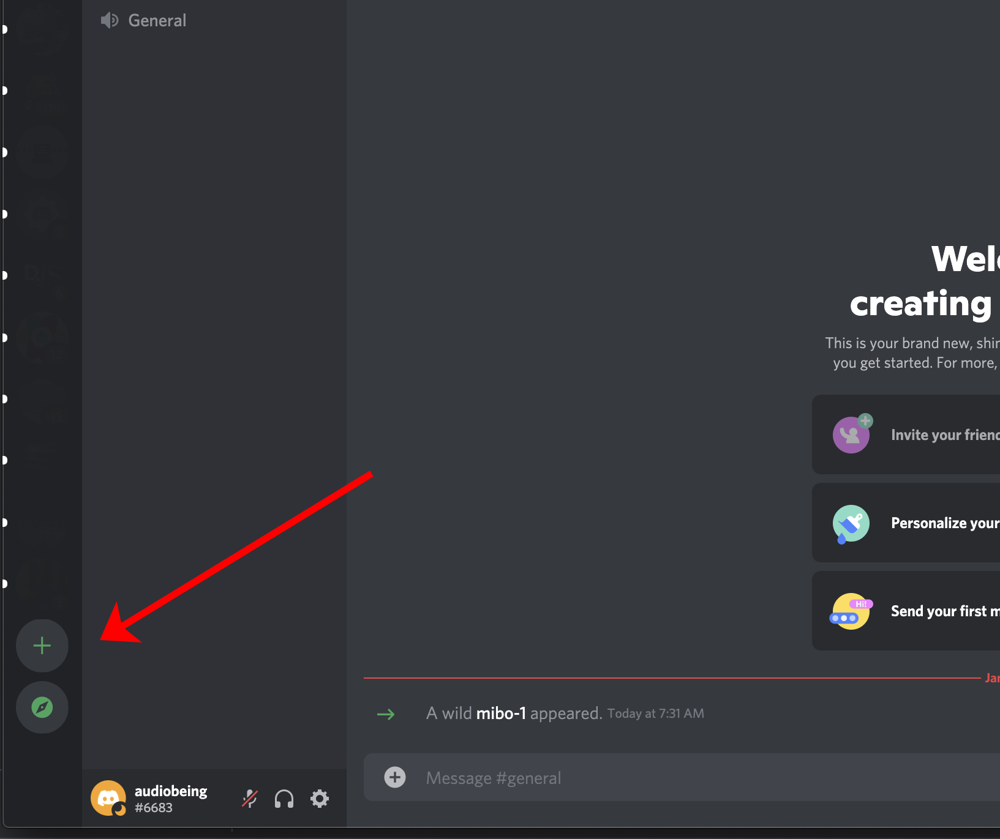
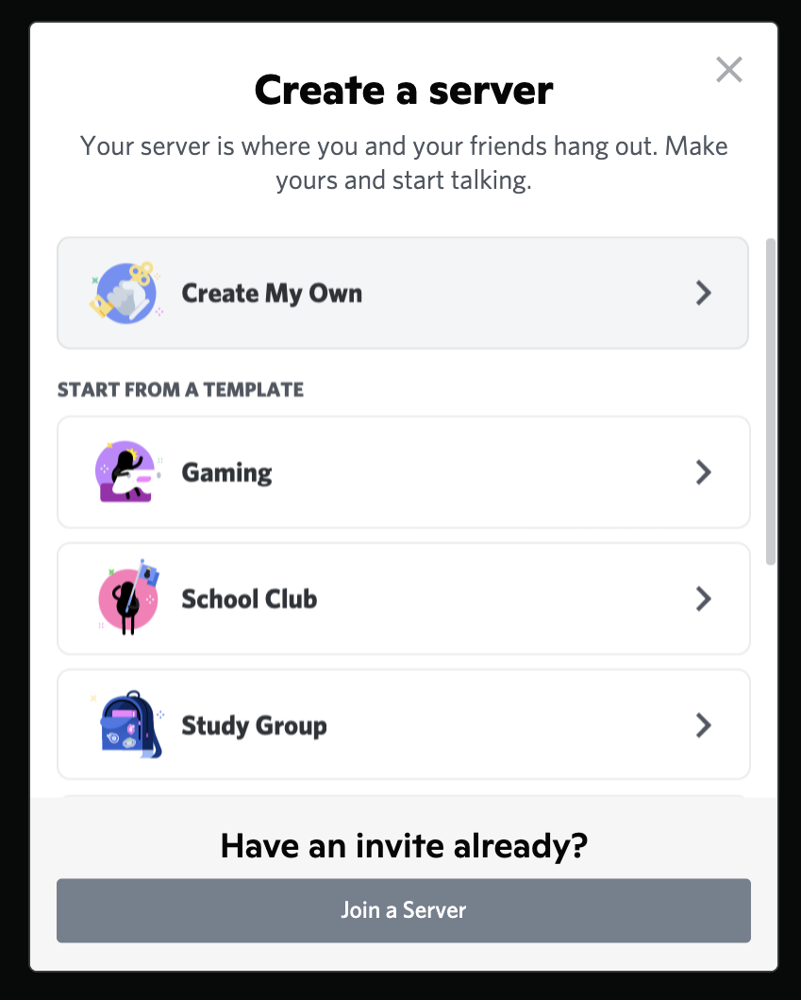
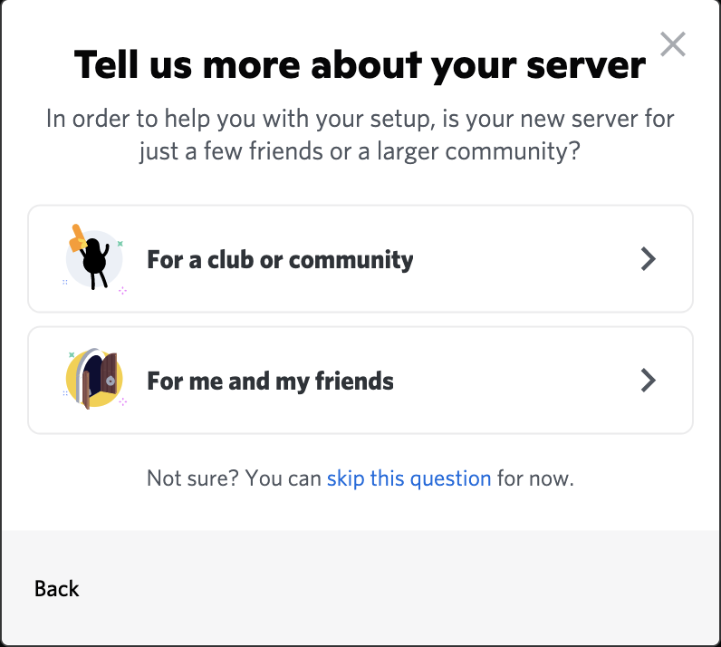
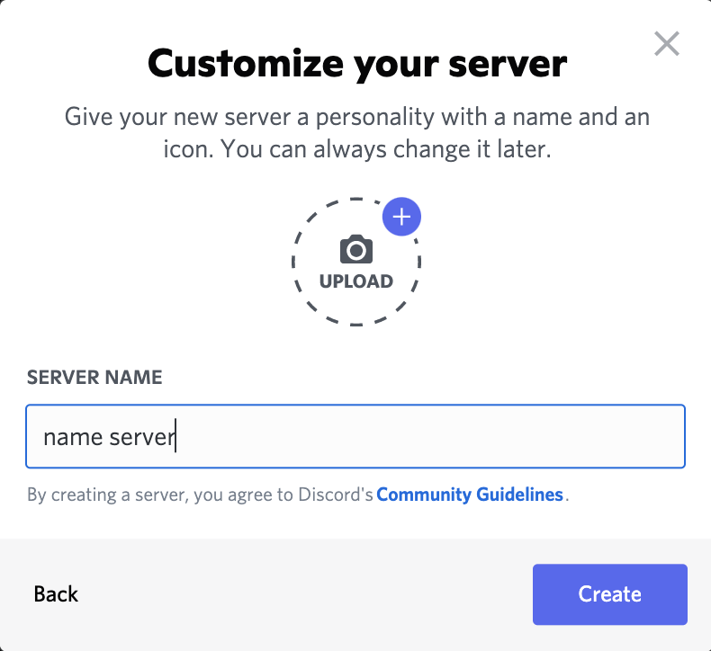

# creating a discord server
1. open discord
1. click the + at the bottom of the left panel in discord 

 
 

1. choose create your own

 
 

1. choose type or skip for now

 
 

1. give it a name

 
 

1. BOOM!!! done

 
 
