# setting up your first discord bot application & adding it to a server
A few things you will need to have prior to setting up a bot and adding it to a server is a discord account (sign up [here](https://discord.com/)), and access to a server for which you have `Administrative` or `Manage Server` permissions. If you have created your own server - you're all good - you've got the permissions needed. Creating a servers is simple (click [here](createDiscordServer.md) to see how it's done). Ok, on we go...
## setting up your discord bot application
1. make sure you are signed in the the [discord website](https://discord.com/) 
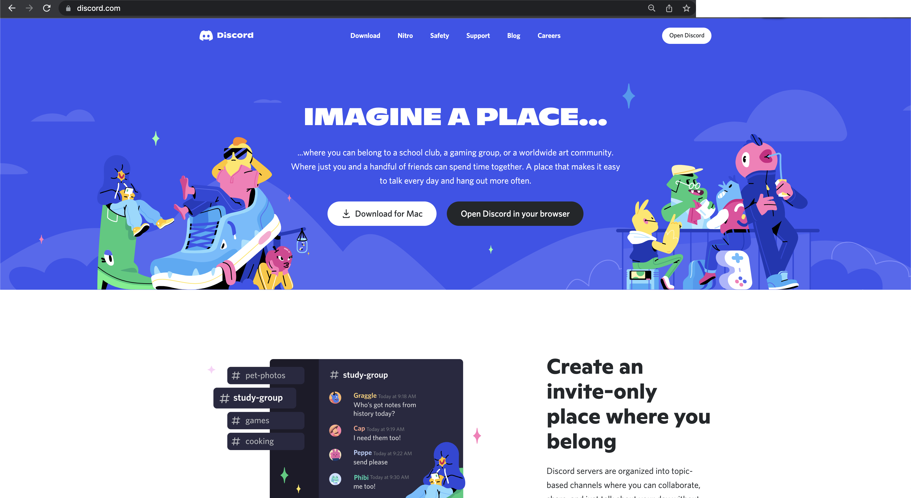
 
 

1. go to the `developers` portal at the bottom of the page if you are not taken to the developers portal automatically
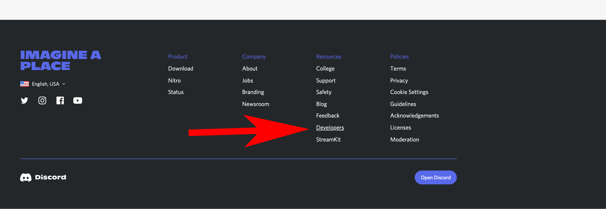
 
 

1. and then click the `applications` tab
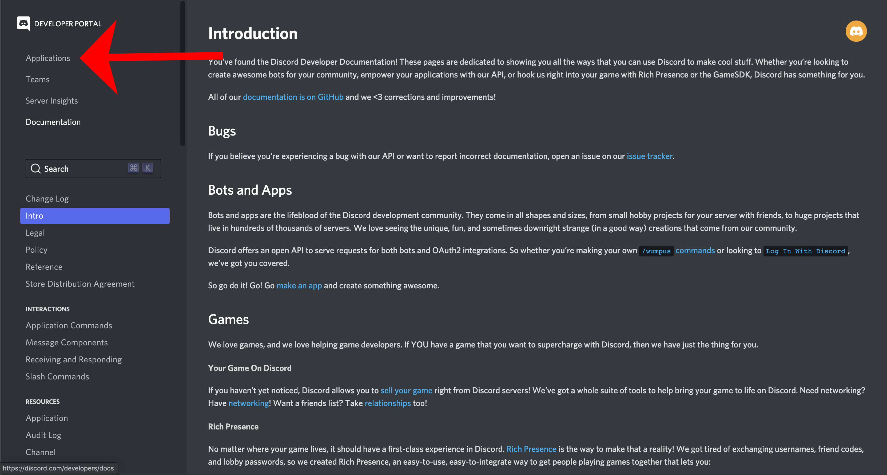
 
 

1. choose new application
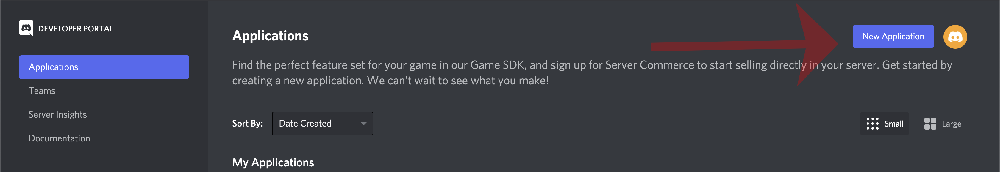
 
 

1. give your bot application a name and hit `create`
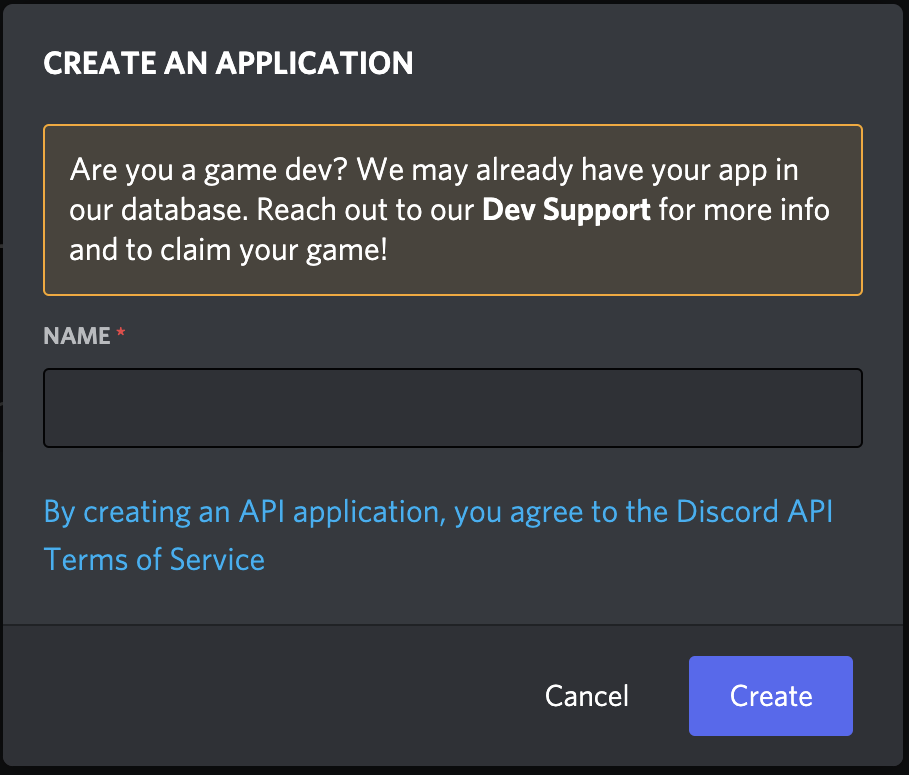
 
 

1. go to the `bot` tab, hit `add bot`, and click `yes,do it!` ... 
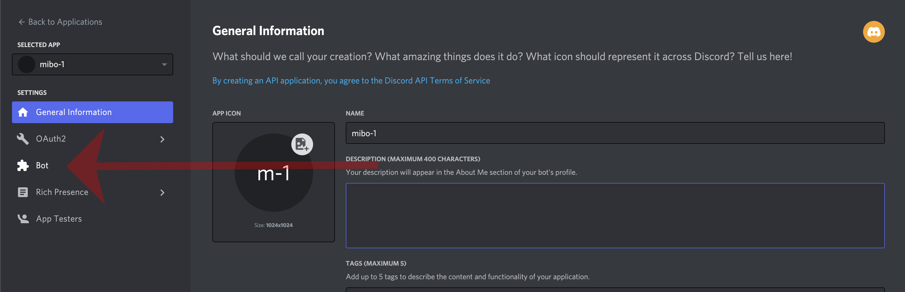
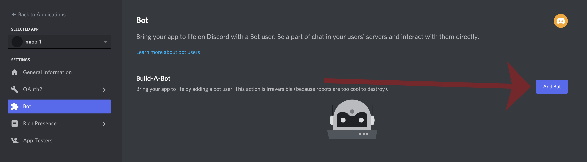
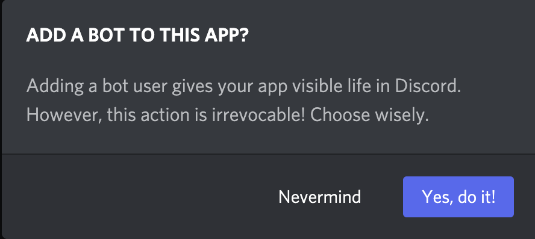
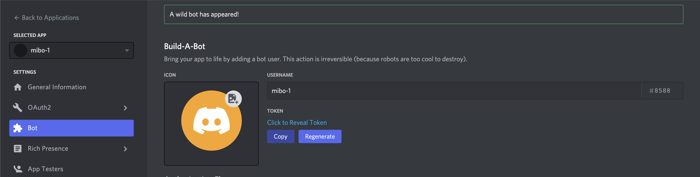
 
 

1. ... and your bot will appear. A couple of ***IMPORTANT*** things to be aware of: 1. the `copy` token button. We will need to return to this later so it is helpful to remember that we are on the `bot settings` for our newly created bot. 2. it is very imortant to ***KEEP THIS TOKEN PRIVATE***. If it every leaked to the public then someone could cause real problems for you and your discord server. We will learn how to handle how to do this in the upcoming section - let's finish by adding our bot to a server. 

 
 

   

## adding your bot to a server
Here is where you will need `Administrative` or `Manage Server` permissions. If you need to create a server you can follow along [here](createDiscordServer.md)

1. go back to the developers portal and click on your new bot
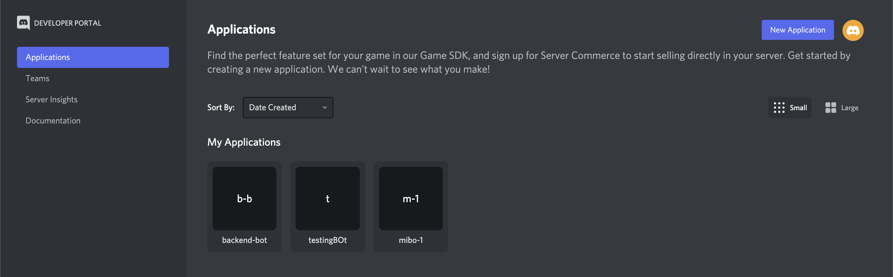
 
 

1. Once in your bot settings click on the tab `OAuth2` and then `URL generator`. Choose `bot` and `application.commands` from the options. Don't worry about the bot permissions options that pop up. We will deal with those in a future tutorial. If you're curious to can review them [here](https://discord.com/developers/docs/topics/permissions), but we don't need them at the moment and can grant permissions from discord.  Click `copy` and you now have the URL to add your bot. 
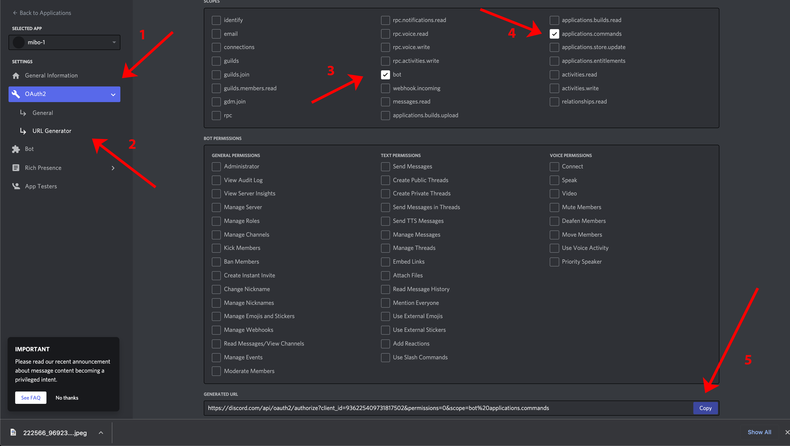
 
 

1. go to a new tab in your browser and paste the URL
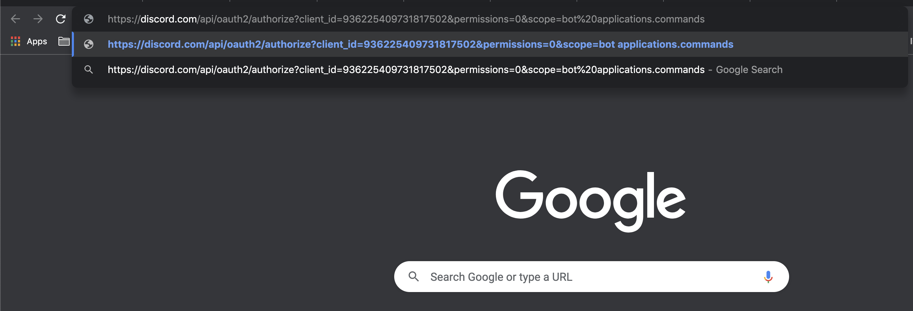
 
 

1. you will see window pop up with  a list of the discord servers you have permissions for.
Choose the server to add the bot.
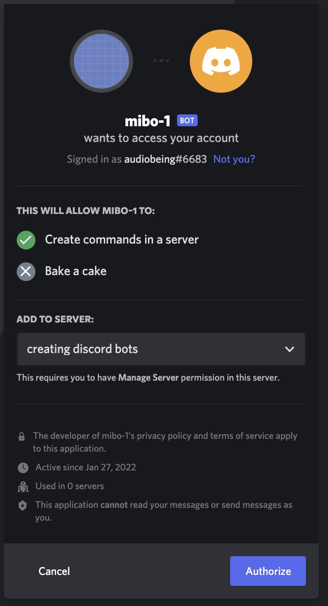
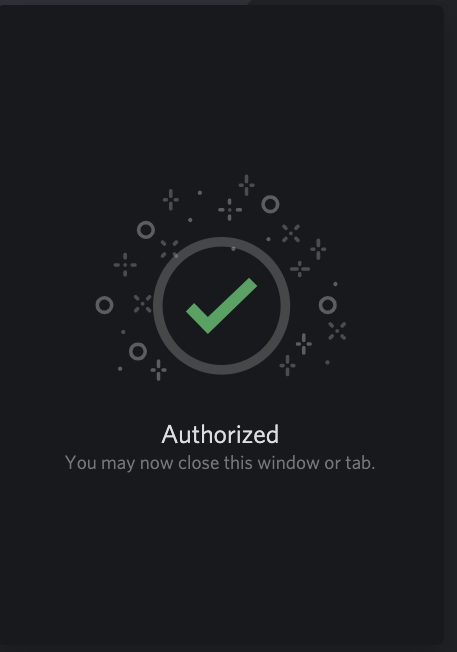
 
 

1. and the bot is now in your server!! You will notice your bot is offline which is ok as it can't do anything yet. No problem, we handle that in the next tutorial. 
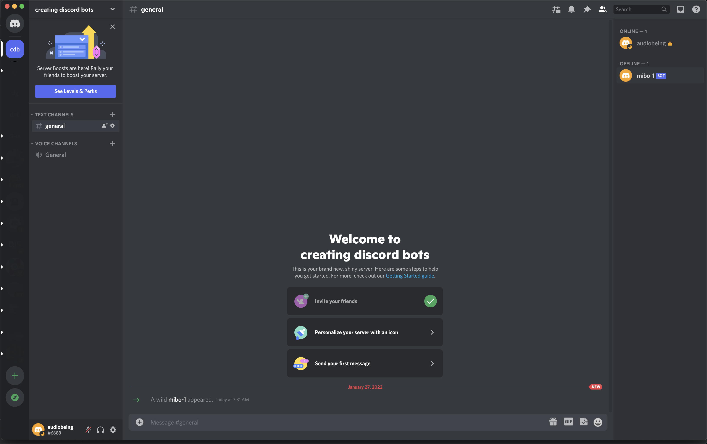
 
 

<!-- CLIPPINGS
 - copy the token 
        - create a config.json file or .env file to and save the token there - if that is unfamiliar save the token in a new file or you can come back and copy it again

- you will need to be part of a server/guild with "Administrative" or “Manage Server” permissions. If you created the server you have Admin permissions. 
    - creating a servers is simple (link to create server)

 -->