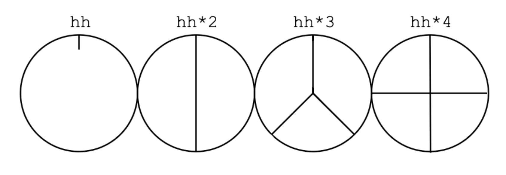

# estuary/tidalCycles

Tidal is a domain-specific programming language (DSL) for creating music that focuses on the creation and manipulation of patterns. 

Estuary is a project that ports tidalCycles to the web (as well as other languages)

- it is smaller than tidalCycles
- aims for easy collaboration and setup (see more about estuary on estuary.mcmaster.ca)

## I. **start/stop sounds and sequences**
`s "bd cp"`
- press the play button or press shift+return/enter (depending on mac/pc)

`-- s "bd cp"`
- the double dash infront of a line of code 'comments out' the code - then execute (same as above)
- or we can select all the code, delete it and execute. 
### adding ~ creates a rest/silence
`s "bd ~ bd cp"`
### add more sounds 
`sound "bd bd hh bd sn bd hh bd"`
- what is happening here?
- each sound takes up and equal space in the cycle

 

 

### try adding *\# & /\#
`s "bd*4"`
`s "bd*4 hh*2"`
`s "bd/2 hh*3"`
### add ?
`s "hh*16?"`
- ?: 50/50 chance each of the 16 will occur in this situation
### `Syntax`
- when you see this by your editing window it means there is an error
### choose a sample from the sound `bank` using :\#
`s "bd:2 bd:1 hh:0 bd sn bd:3 hh:2 hh:2"`
### we can change the cps (cycles per second) or bpm (beats per minute) in the estuary console
`!setcps 0.5` 
- this is the default: one cycle = 2 seconds

`!setbmp 60` 
- 1 beat per second (tempo in traditional music notation)

### take a few moments to explore some other sounds
#### short samples
- variations on a theme (usualy percussion): `bd`, `sn`, `ht` 
- full kit in the bank/folder: `odx`
- phrase chopped up: `bip`, `tabla`, `auto`, `amencutup`
- scales chopped up: `arpy`, `latibro`
- more: `flick sid can metal future gabba sn mouth co gretsch mt arp h cp cr newnotes bass hc tabla bass0 hh bass1 bass2 oc bass3 ho odx diphone2 house off ht tink perc bd industrial pluck trump printshort jazz voodoo birds3 procshort blip drum jvbass psr wobble`

## II. **adding effects**

`s "bd sn:2  bd:2 hh*2" # vowel "a"`

`s "bd sn:2  bd:2 hh*2" # vowel "a e i o u"`
- the pattern comes from the left side

`s "bd sn:2  bd:2 hh*2" # pan "0 0.25 0.75 1"`
- pan is between 0 and 1

`s "bd sn:2  bd:2 hh*2" # speed "2 0.25 0.75 1"`
`s "bd sn:2  bd:2 hh*2" # gain "1 0.25 0.75 1"`

## III. patterns/sequences and subsequences
### Fit a subsequence into a step with square brackets:

`s "bd [bd cp] bd bd"`

### This can make for flexible time signatures:

`s "[bd bd sn:5] [bd sn:3]"`

### You can put subsequences inside subsequences:
`s "[[bd bd] bd sn:5] [bd sn:3]"`

### Keep going..
`s "[[bd [bd bd bd bd]] bd sn:5] [bd sn:3]"`

### Polymetric / polyrhythmic sequences

### Play two subsequences at once by separating with a comma:

`s "[voodoo voodoo:3, arpy arpy:4 arpy:2]"`

## IV. transforming patterns
- play at the same time
`s "[bd sn:2, hh*3 hh:3*2]"`

### slow it down

`slow 2 $ s "[bd sn:2, hh*3 hh:3*2]"`

### speed it up

`fast 2 $ s"[bd sn:2, hh hh:2*2]"`

### have it happen every #

`every 4 (fast 2) $ s "bd [~ sn]"`

## VI. longer samples and granulation(ish)
- some long samples (koy sax ade alex alone bev pad)

### chop

`s "bev"`
- when you stop it, it keeps playing through

### chop it into bits:

`chop 32 $ s "bev"`

### slow it down to fit 8 cycles:
`loopAt 8 $ chop 128 $ s "bev"`

### transform the grain pattern:

`rev $ loopAt 8 $ chop 128 $ s "bev"`

### striate vs chop

`slow 4 $ chop 4 $ s "arpy:1 arpy:2 arpy:3 arpy:4"`

`slow 4 $ striate 4 $ s "arpy:1 arpy:2 arpy:3 arpy:4"`

## Arbitrariness and 'random numbers'

#### randslice
`randslice 1128 $ s "bev*16"`

#### random sample
`s "arpy*8" # n (irand 16)`

#### degradeBy
`degradeBy 0.5 $ s "bd sn cp sn:2"`

## VII. collaborative strategies

